# Netia AI Chatbot 🤖

**A smart robot that talks to customers on websites!**

Think of this like having a super smart helper that can:
- 💬 Talk to people who visit your website
- 📅 Help them book appointments
- 💰 Answer questions about prices
- 📝 Remember what they talked about
- 🎯 Figure out what they really want

## 🏠 What's Inside This Box?

```
┌─────────────────┐    ┌─────────────────┐    ┌─────────────────┐
│   Your Website  │    │   Your Control  │    │   Your Customers│
│   (Where people │    │   Panel         │    │   (The people   │
│   see the chat) │    │   (Where you    │    │   who ask       │
│                 │    │   manage stuff) │    │   questions)    │
└─────────┬───────┘    └─────────┬───────┘    └─────────┬───────┘
          │                      │                      │
          │                      │                      │
          └──────────────────────┼──────────────────────┘
                                 │
                    ┌─────────────▼─────────────┐
                    │    The Smart Brain        │
                    │   (This is where the      │
                    │    magic happens!)        │
                    │  - Understands what       │
                    │    people are asking      │
                    │  - Gives smart answers    │
                    │  - Remembers everything   │
                    └─────────────┬─────────────┘
                                  │
                    ┌─────────────▼─────────────┐
                    │    The Memory Bank        │
                    │   (Stores all the         │
                    │    conversations and      │
                    │    information)           │
                    └───────────────────────────┘
```

### The Main Parts:
- **🤖 The Smart Robot**: Talks to your customers and gives them answers
- **🎛️ Your Control Panel**: Where you can see what's happening and change settings
- **💾 The Memory Bank**: Remembers all the conversations and information
- **🌐 Your Website**: Where customers see and use the chat

## 🔄 How It Works (Super Simple!)

```mermaid
graph TD
    A[👤 Customer visits your website] --> B[💬 Customer types a message]
    B --> C[🤖 Smart Robot reads the message]
    C --> D{🧠 What does the customer want?}
    D -->|Wants to book| E[📅 Help them book an appointment]
    D -->|Asks about price| F[💰 Tell them the price]
    D -->|Has a question| G[❓ Answer their question]
    E --> H[📝 Remember this conversation]
    F --> H
    G --> H
    H --> I[✅ Customer is happy!]
```



**In simple words:**
1. Someone visits your website
2. They type a message in the chat
3. Our smart robot reads it and figures out what they want
4. The robot gives them a helpful answer
5. Everything gets saved so we remember next time
6. The customer is happy! 🎉

## 📁 Monorepo Structure

```
/
├── api/                    # Backend API (Node.js/Express)
│   ├── src/               # Source code
│   ├── config/            # Configuration files
│   ├── tests/             # Test suites
│   └── package.json       # API dependencies
├── web/                    # Internal Dashboard (Next.js)
│   ├── src/               # React components
│   ├── public/            # Static assets
│   └── package.json       # Web dependencies
├── docs/                   # Target architecture documentation
│   ├── system-architecture.md
│   ├── development-plan.md
│   └── application-overview.md
├── aidocs/                 # AI-generated documentation
├── legacy/                 # Legacy code and old docs
└── package.json           # Root monorepo scripts
```

## 🚀 Quick Start

### Prerequisites
- Node.js 18+ 
- npm or yarn
- Neon Database account
- OpenAI API key
- Crisp account (for chat integration)

### Install All Dependencies
```bash
npm run install:all
```

### Environment Setup
```bash
# API environment
cp api/env.example api/.env
# Edit api/.env with your credentials

# Web environment  
cp web/env.example web/.env.local
# Edit web/.env.local with your settings
```

### Development
```bash
# Run both API and Web dashboard
npm run dev

# Or run individually:
npm run dev:api    # API only (port 3000)
npm run dev:web    # Web dashboard only (port 3001)
```

### Health Checks
```bash
npm run check:health    # API health check
npm run check:webhook   # Webhook endpoint test
```

## 🎯 Application Overview

### How It Works
1. **Customer Integration**: Businesses embed Crisp chat widget on their websites
2. **AI Processing**: When users chat, messages are sent to our API via Crisp webhooks
3. **Intent Detection**: Our AI analyzes messages to understand user intent (booking, pricing, support, etc.)
4. **Smart Responses**: AI generates contextual responses using tenant-specific knowledge
5. **Lead Capture**: Booking and pricing inquiries automatically create leads
6. **Admin Management**: Business owners manage their chatbot through our web dashboard

### Key Features
- **Multi-Tenant Architecture**: Each customer has isolated data and configuration
- **API Key Authentication**: Secure access control for each tenant
- **Intent Detection**: AI-powered understanding of user messages
- **Knowledge Base**: Tenant-specific FAQ and system prompts
- **Calendar Integration**: Automated booking and scheduling
- **Lead Management**: Automatic lead capture and tracking
- **Real-time Chat**: Crisp webhook integration for instant responses
- **Admin Dashboard**: Comprehensive management interface
- **Billing Integration**: Stripe-powered subscription management

## API Endpoints

- `GET /health` - Health check
- `GET /metrics` - Prometheus metrics (includes HTTP and LLM metrics)
- `POST /crisp/webhook` - Crisp webhook handler
- `POST /chat` - Public chat API
- `GET /calendar/slots` - Mock availability
- `POST /calendar/book` - Mock booking (returns eventId)

## WebSocket Events

### Client to Server:
- `join-conversation` - Join a conversation room
- `send-message` - Send a message to the bot

### Server to Client:
- `conversation-history` - Receive conversation history when joining
- `new-message` - Receive new messages (both user and bot)

## Example Client Usage

```javascript
const io = require('socket.io-client');
const socket = io('http://localhost:3000');

socket.emit('join-conversation', 'conversation-123');
socket.emit('send-message', {
  conversationId: 'conversation-123',
  message: 'Hello bot!',
  userId: 'user-456'
});

socket.on('new-message', (message) => {
  console.log('New message:', message);
});
```

## Configuration

Set environment variables in `.env`:
- `PORT` - Server port (default: 3000)
- `DRY_RUN` - true to disable external effects
- `KILL_SWITCH` - true to pause webhook logic
- `DEMO_MODE` - true to enable demo templates
- `OPENAI_API_KEY`, `OPENAI_MODEL` - LLM live mode
- `DATABASE_URL` - Postgres connection
- `REDIS_URL` - Redis connection (rate limiting)
- `CORS_ORIGIN` - Allowed origin(s)
- `CRISP_IDENTIFIER`, `CRISP_KEY`, `CRISP_WEBSITE_ID` - Crisp credentials
- `CRISP_WEBHOOK_SECRET` - Verify webhook signatures
