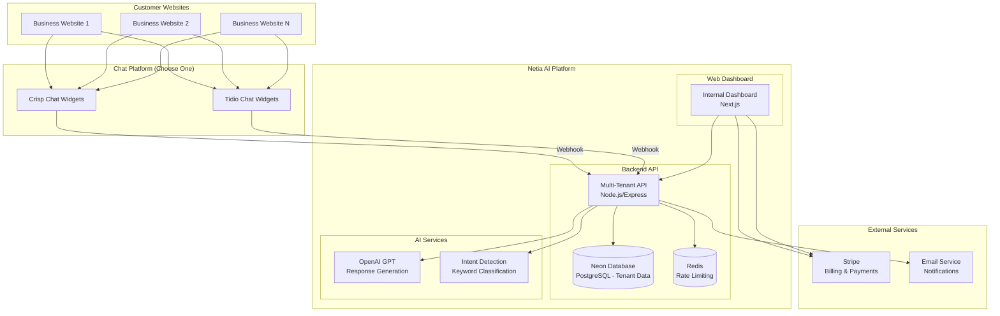

# System Architecture

## Overview

The Netia AI Chatbot is a multi-tenant SaaS platform that provides AI-powered customer service automation for small businesses. The system consists of a backend API and an internal web dashboard for management.

## High-Level Architecture



## Component Details

### Backend API (`/api`)

**Technology Stack:**
- Node.js with Express.js
- Neon Database (PostgreSQL) for data persistence
- Redis for rate limiting and caching
- OpenAI GPT for AI responses

**Key Features:**
- Multi-tenant architecture with API key authentication
- Tenant-specific data isolation
- Intent detection and AI response generation
- Crisp webhook integration
- Rate limiting and security measures
- Prometheus metrics and monitoring

**API Endpoints:**
- `POST /api/v1/chat` - Public chat API (requires API key)
- `POST /crisp/webhook` - Crisp integration (uses website_id for tenant identification)
- `POST /tidio/webhook` - Tidio integration (uses conversation data for tenant identification)
- `GET /api/v1/health` - Health check
- `GET /api/v1/metrics` - Prometheus metrics
- `GET /api/v1/admin/*` - Admin management endpoints
- `GET /api/v1/customer/*` - Customer portal endpoints

### Web Dashboard (`/web`)

**Technology Stack:**
- Next.js 14 with TypeScript
- Tailwind CSS for styling
- React Hook Form with Zod validation
- Neon Auth (passwordless magic link authentication)

**Key Features:**
- Role-based access (Admin vs Customer)
- Tenant management and onboarding
- Subscription and billing management
- Chatbot configuration interface
- Analytics and reporting
- Customer support tools

### Database Schema

**Core Tables:**
```sql
-- Tenant management
tenants (id, name, email, subscription_status, crisp_website_id, tidio_website_id, created_at)
api_keys (id, tenant_id, key_hash, name, permissions, created_at)

-- Tenant-specific data
conversations (id, tenant_id, session_id, created_at)
messages (id, tenant_id, conversation_id, role, content, timestamp)
leads (id, tenant_id, intent, contact_info, created_at)

-- Configuration
tenant_configurations (id, tenant_id, config_type, config_data)
knowledge_bases (id, tenant_id, content, updated_at)
```

## Data Flow

### 1. Customer Website Interaction
```
Website Visitor → Types message in chat widget (Crisp or Tidio)
                ↓
            Chat Platform → Sends webhook to Netia API
                ↓
            Netia API → Identifies tenant via website_id (Crisp) or conversation data (Tidio)
                ↓
            Netia API → Processes with AI and tenant config
                ↓
            Netia API → Sends response back to chat platform
                ↓
            Chat Platform → Shows response to visitor
```

### 2. Admin/Customer Management
```
Admin/Customer → Logs into web dashboard
                ↓
            Web Dashboard → Authenticates with API
                ↓
            API → Returns tenant-specific data
                ↓
            Web Dashboard → Displays management interface
```

## Security Architecture

### Authentication & Authorization
- **Website ID**: Tenant identification for Crisp webhook requests
- **API Keys**: Tenant identification for direct API requests
- **Neon Auth**: Passwordless magic link authentication for web dashboard
- **Role-based Access**: Admin vs Customer permissions
- **HMAC Verification**: Crisp webhook security

### Data Protection
- **Tenant Isolation**: Complete data separation between customers
- **PII Redaction**: Automatic removal of sensitive information from logs
- **Rate Limiting**: Redis-backed request throttling
- **CORS Protection**: Configurable origin restrictions

### Infrastructure Security
- **HTTPS/TLS**: Encrypted transport
- **Security Headers**: Helmet.js for CSP, HSTS, etc.
- **Input Validation**: JSON schema validation for all endpoints
- **Error Handling**: Graceful degradation and secure error responses

## Deployment Architecture

### Production Environment
- **Backend API**: Deployed on Render.com
- **Web Dashboard**: Deployed on Vercel
- **Database**: Neon Database (serverless PostgreSQL)
- **Redis**: Managed Redis service
- **CDN**: For static assets and file uploads

### Development Environment
- **Local Development**: Docker Compose for services
- **API**: `http://localhost:3000`
- **Web Dashboard**: `http://localhost:3001`
- **Database**: Neon Database (development branch)
- **Redis**: Local Redis instance

## Scalability Considerations

### Horizontal Scaling
- **Stateless API**: Can run multiple instances
- **Database Connection Pooling**: Efficient resource utilization
- **Redis Clustering**: Distributed rate limiting and caching
- **Load Balancing**: Multiple API instances behind load balancer

### Performance Optimization
- **Response Caching**: Redis caching for frequent requests
- **Database Indexing**: Optimized queries for tenant data
- **Connection Pooling**: Efficient database connections
- **CDN Integration**: Fast static asset delivery

### Monitoring & Observability
- **Prometheus Metrics**: Request counts, durations, error rates
- **Structured Logging**: Pino with request IDs and PII redaction
- **Health Checks**: Automated monitoring and alerting
- **Error Tracking**: Sentry integration for error monitoring

## Integration Points

### External Services
- **Crisp Chat**: Webhook integration for chat widget
- **OpenAI**: GPT API for AI response generation
- **Stripe**: Payment processing and subscription management
- **Email Service**: SMTP for notifications and alerts

### Future Integrations
- **CRM Systems**: HubSpot, Salesforce integration
- **Calendar Services**: Google Calendar, Calendly
- **Analytics**: Google Analytics, Mixpanel
- **File Storage**: AWS S3 for document uploads
