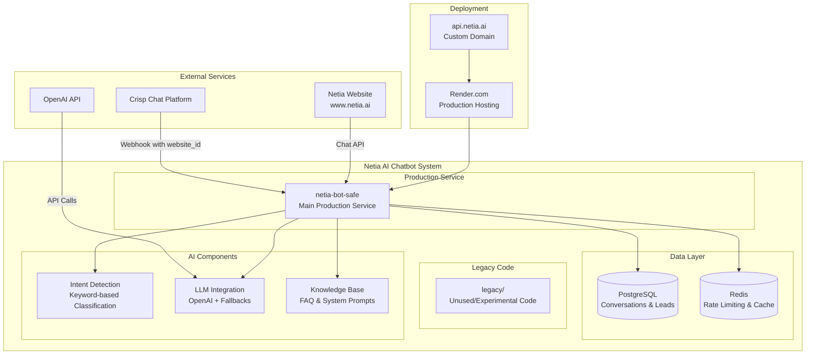
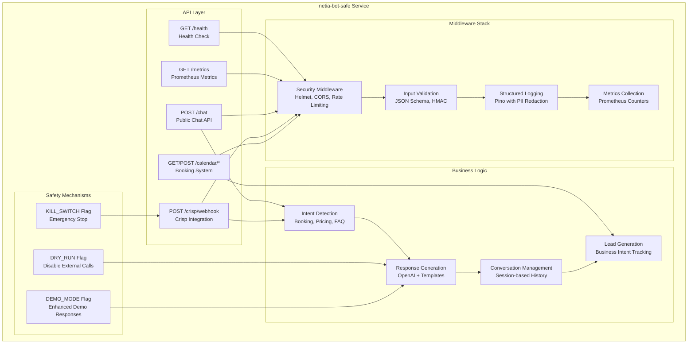
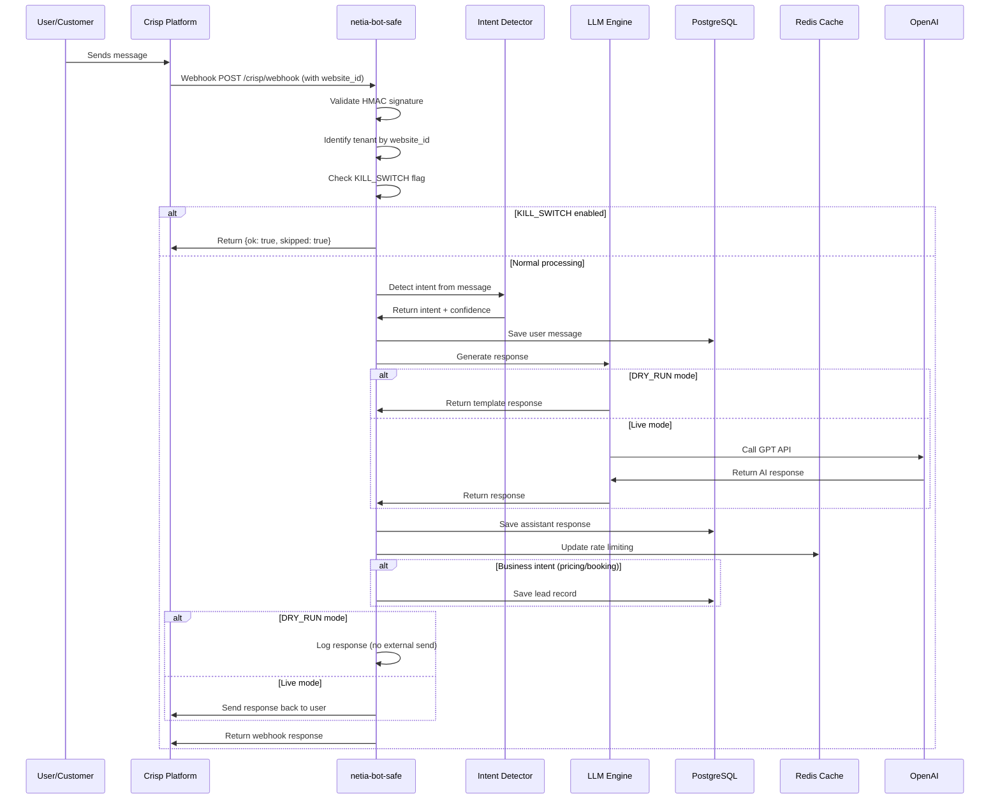
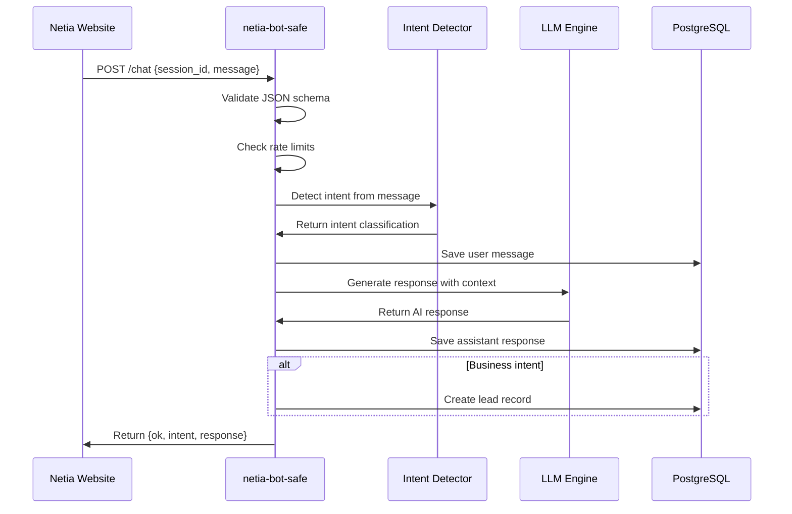
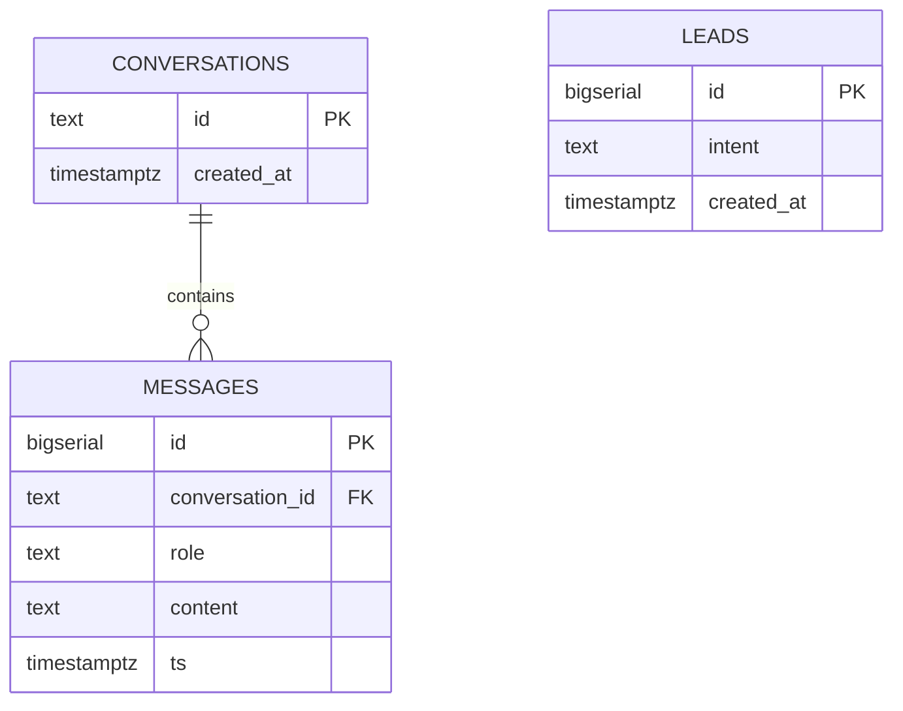
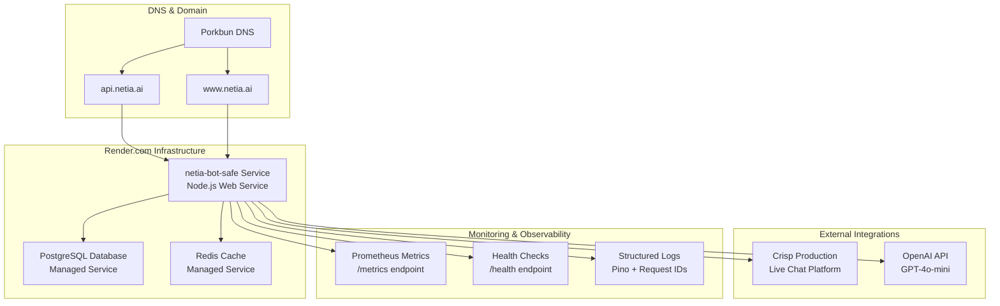
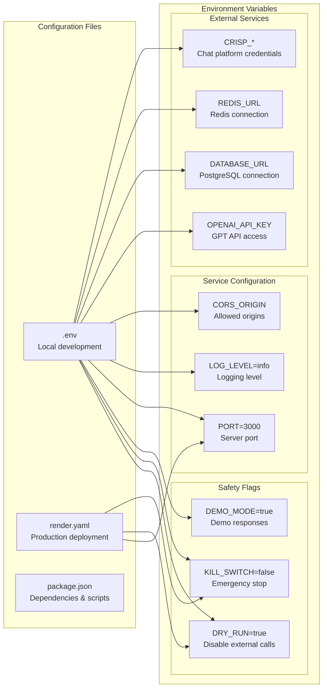
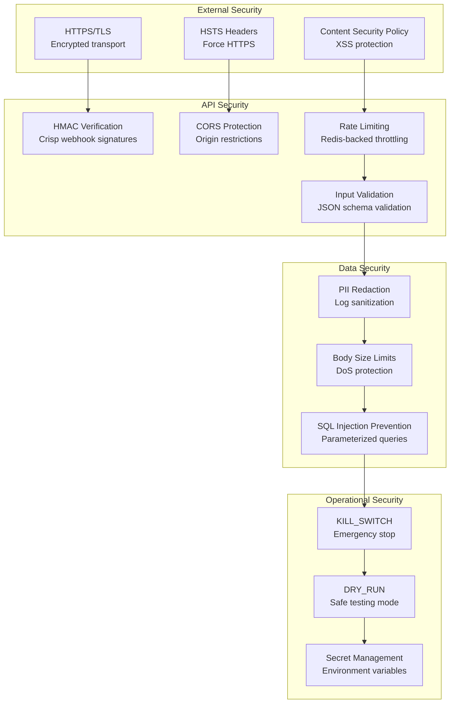

# Netia AI Chatbot - System Architecture

## High-Level Architecture

The Netia AI Chatbot system is designed as a multi-service architecture with clear separation of concerns, safety mechanisms, and production-ready deployment capabilities.



## Service Architecture

### Primary Service: netia-bot-safe

The main production service that handles all customer interactions and integrations.



## Data Flow Architecture

### Conversation Processing Flow



### Public Chat API Flow



## Database Schema Architecture



## Deployment Architecture

### Production Deployment on Render.com



### Environment Configuration



## Security Architecture

### Security Layers



## Monitoring & Observability

### Metrics Collection

```mermaid
graph LR
    subgraph "Application Metrics"
        HTTPMetrics[HTTP Request Metrics<br/>Count, Duration, Status]
        LLMMetrics[LLM Request Metrics<br/>Success/Error rates]
        BusinessMetrics[Business Metrics<br/>Leads, Conversions]
    end
    
    subgraph "System Metrics"
        SystemMetrics[System Metrics<br/>CPU, Memory, Uptime]
        DatabaseMetrics[Database Metrics<br/>Connections, Queries]
        CacheMetrics[Cache Metrics<br/>Hit rates, Latency]
    end
    
    subgraph "Prometheus Endpoints"
        MetricsEndpoint[/metrics<br/>Prometheus format]
        HealthEndpoint[/health<br/>Service health]
    end
    
    HTTPMetrics --> MetricsEndpoint
    LLMMetrics --> MetricsEndpoint
    BusinessMetrics --> MetricsEndpoint
    SystemMetrics --> MetricsEndpoint
    DatabaseMetrics --> MetricsEndpoint
    CacheMetrics --> MetricsEndpoint
    
    MetricsEndpoint --> HealthEndpoint
```

## Implementation Status

Based on the existing documentation, here's the current implementation status:

### ✅ Completed Features
- **Core Service**: netia-bot-safe with Express.js framework
- **Safety Mechanisms**: DRY_RUN, KILL_SWITCH, DEMO_MODE flags
- **API Endpoints**: /health, /metrics, /chat, /crisp/webhook, /calendar/*
- **AI Components**: IntentDetector, NetiaLLM with OpenAI integration
- **Database**: PostgreSQL with automatic schema initialization
- **Security**: HMAC verification, CORS, rate limiting, PII redaction
- **Monitoring**: Prometheus metrics, structured logging
- **Deployment**: Render.com configuration with custom domain

### 🔄 In Progress
- **TypeScript Migration**: Planned for core modules
- **Load Testing**: Performance validation
- **CI/CD Pipeline**: Automated testing and deployment

### 📋 Planned Features
- **Advanced Analytics**: Business intelligence and reporting
- **Multi-language Support**: Internationalization
- **Advanced AI Features**: Context-aware responses, sentiment analysis
- **Integration Expansion**: Additional chat platforms and CRM systems

## Performance Characteristics

### SLOs (Service Level Objectives)
- **Uptime**: 99.5%
- **Latency**: p95 < 1.5s
- **Error Rate**: < 1%

### Scalability Features
- **Stateless Design**: Horizontal scaling capability
- **Database Connection Pooling**: Efficient resource utilization
- **Redis Caching**: Performance optimization
- **Rate Limiting**: Protection against abuse
- **Graceful Degradation**: Fallback responses during service issues

This architecture provides a robust, scalable, and maintainable foundation for the Netia AI Chatbot system, with clear separation of concerns and comprehensive safety mechanisms for production deployment.
